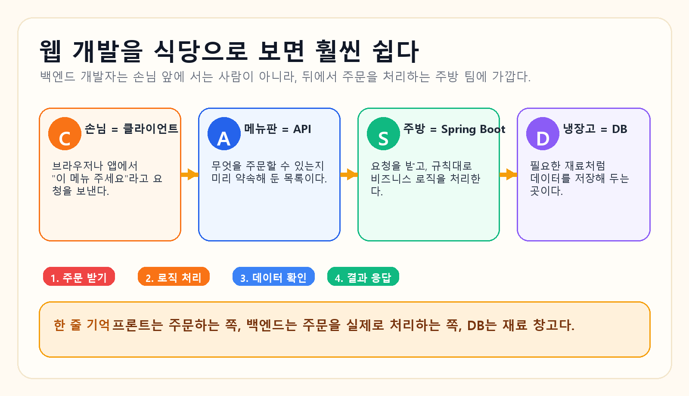
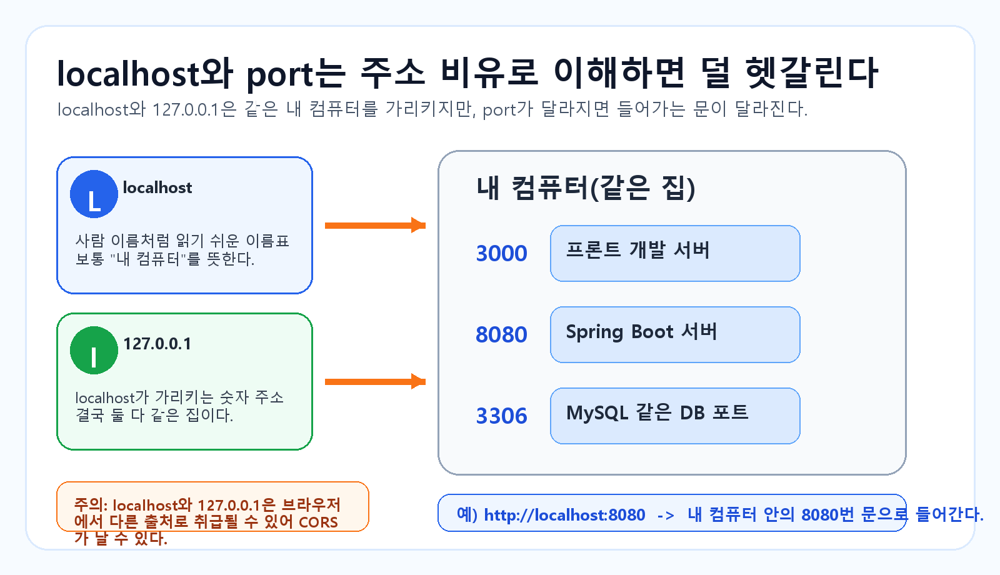
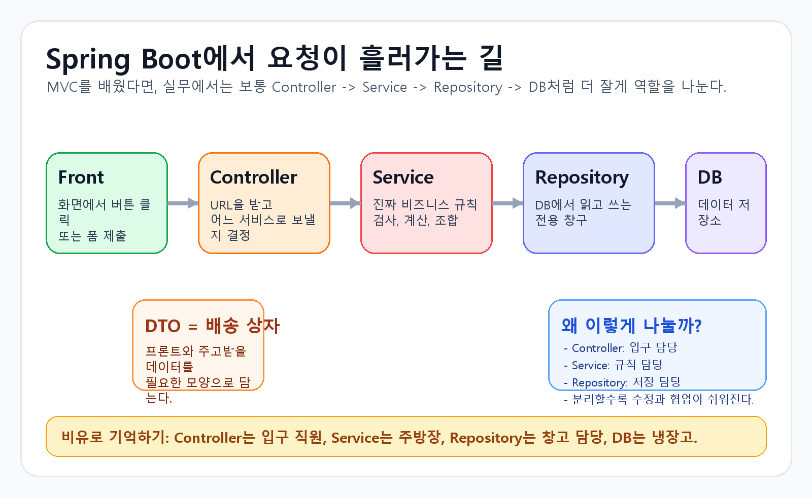

# [Spring 1] 웹 기초를 식당 비유로 다시 이해해보기

> 첨부된 `spring1.pdf`를 다시 읽으면서 만든 리마인드 회고록입니다.  
> 이번 첫 시간의 핵심은 **웹은 요청과 응답의 반복**이고, **백엔드 개발자는 그 흐름을 뒤에서 책임지는 사람**이라는 점이었습니다.

---

## 이 글에서 꼭 가져가면 좋은 한 줄

**프론트가 주문을 넣고, 백엔드는 주방처럼 그 주문을 처리하고, DB는 재료 창고처럼 데이터를 보관한다.**  
그리고 Spring Boot는 그 주방을 **역할별로 덜 헷갈리게 나눠서 관리하게 해주는 프레임워크**다.

### 오늘 글을 읽고 나면 체크해볼 것

- [ ] `클라이언트 / 서버 / DB / API`가 각각 무슨 역할인지 설명할 수 있다.
- [ ] `localhost`와 `port`가 왜 같이 나오는지 말할 수 있다.
- [ ] `JSON`은 데이터 형식이고, `API`는 프론트와 백엔드의 약속이라는 걸 구분할 수 있다.
- [ ] Spring이 왜 라이브러리가 아니라 프레임워크인지 감이 온다.
- [ ] `Controller -> Service -> Repository -> DB` 흐름을 처음 보는 사람에게 설명할 수 있다.

---

## 1. 수업 전체 흐름: 웹을 식당으로 보면 갑자기 쉬워진다

이번 발표에서 제일 좋았던 지점은, 처음부터 복잡한 기술 용어를 던지기보다 **식당 비유로 웹의 큰 그림**을 보여줬다는 점이었다.  
처음 웹을 배울 때는 `클라이언트`, `서버`, `DB`, `API`가 전부 따로 놀아 보이는데, 식당으로 바꾸면 관계가 한 번에 보인다.



| 웹 개발 요소 | 식당 비유 | 초보자 기준 한 줄 설명 |
| --- | --- | --- |
| 클라이언트(Client) | 손님 | 브라우저나 앱에서 요청을 보내는 쪽 |
| API | 메뉴판 | 무엇을 요청할 수 있는지 정리된 약속 |
| 서버(Spring Boot) | 주방 | 요청을 받아 실제 작업을 처리하는 곳 |
| DB | 냉장고 | 필요한 데이터가 저장된 곳 |

### 여기서 백엔드 개발자는 누구일까?

수업에서는 백엔드 개발자를 **손님 눈에는 보이지 않는 주방장**으로 설명했다.

1. 손님이 주문한 메뉴를 잘 받는다.
2. 냉장고에서 재료를 꺼내 레시피대로 요리한다.
3. 완성한 음식을 다시 내보낸다.

이 비유가 중요한 이유는, 백엔드를 처음 배울 때 많은 사람이 **\"서버도 화면을 만드는 건가?\"**, **\"API가 데이터를 저장하는 건가?\"**처럼 역할을 섞어 생각하기 쉽기 때문이다.  
하지만 이 구조로 보면 훨씬 단순해진다.

- **프론트**는 주문을 넣는 쪽
- **백엔드**는 주문을 처리하는 쪽
- **DB**는 재료를 꺼내는 곳
- **API**는 주문 가능한 메뉴를 적어둔 약속

---

## 2. 웹은 결국 요청(Request)과 응답(Response)의 반복이다

발표 자료에서 아주 크게 잡고 간 메시지는 이것이었다.

> **결국 모든 웹/앱 서비스의 메커니즘은 요청과 응답의 반복이다.**

예를 들어 인스타그램에서 게시글을 본다고 하면:

1. 내가 앱에서 게시글 화면을 연다.
2. 프론트가 백엔드에 \"이 게시글 정보 줘\"라고 요청한다.
3. 백엔드는 DB에서 데이터를 찾는다.
4. 찾은 결과를 JSON 같은 형식으로 응답한다.
5. 프론트가 그 응답을 화면에 그려준다.

즉, 사용자는 버튼만 누르지만 뒤에서는 계속 이 흐름이 돈다.

`요청 -> 처리 -> 응답 -> 화면 갱신`

이 한 줄이 처음엔 너무 당연해 보여도, 나중에 `HTTP`, `API`, `MVC`, `Layered Architecture`를 배울 때 전부 여기서 이어진다.

---

## 3. HTTP는 \"웹에서 대화하는 규칙\"이다

수업에서는 HTTP를 **브라우저와 서버가 데이터를 주고받을 때 따르는 규칙**으로 설명했다.  
초보자 입장에서는 \"프로토콜\"이라는 단어가 제일 딱딱한데, 그냥 이렇게 생각하면 된다.

> **HTTP는 프론트와 백엔드가 대화할 때 지켜야 하는 말투와 규칙이다.**

### HTTP 메서드: 어떤 종류의 요청인지 알려주는 표시

| 메서드 | 보통 하는 일 | 식당 비유 |
| --- | --- | --- |
| `GET` | 조회 | 메뉴판이나 주문 내역을 확인하기 |
| `POST` | 생성 | 새 주문 넣기 |
| `PUT` | 수정 | 기존 주문 전체를 바꾸기 |
| `DELETE` | 삭제 | 주문 취소하기 |

초보자는 여기서 `GET`과 `POST`만 먼저 확실히 구분해도 엄청 큰 진전이다.

- `GET`은 **읽기**
- `POST`는 **만들기**

예를 들면:

- `GET /posts/1` -> 1번 게시글 정보 보여줘
- `POST /posts` -> 새 게시글 하나 등록할게

### HTTP 상태 코드: 요청 결과를 숫자로 알려주는 신호

수업 자료에서는 상태 코드도 식당 비유로 풀어줘서 이해가 쉬웠다.

| 상태 코드 | 뜻 | 식당 비유 |
| --- | --- | --- |
| `200 OK` | 요청 성공 | 메뉴 잘 나왔습니다 |
| `201 Created` | 생성 성공 | 새 메뉴가 만들어졌습니다 |
| `400 Bad Request` | 잘못된 요청 | 주문서를 이상하게 적었습니다 |
| `404 Not Found` | 대상 없음 | 그런 메뉴는 없습니다 |
| `500 Internal Server Error` | 서버 내부 문제 | 주방에서 문제가 생겼습니다 |

실제로 개발하다 보면 브라우저 개발자 도구나 Swagger에서 이 숫자를 엄청 자주 보게 된다.  
그래서 상태 코드는 그냥 외우기보다 **\"요청 결과를 서버가 숫자로 알려주는 것\"**이라고 먼저 이해하는 게 좋다.

---

## 4. `localhost`와 `port`는 왜 항상 같이 붙을까?

처음 스프링 프로젝트를 띄우면 자주 보는 게 이 주소다.

```text
http://localhost:8080
```

근데 막상 처음 보면 이런 생각이 든다.

- `localhost`는 또 뭐지?
- 왜 뒤에 `:8080`이 붙지?
- 그냥 내 컴퓨터에서 실행한 건데 왜 주소가 필요하지?

이 부분도 발표 자료처럼 **주소 비유**로 보면 이해가 잘 된다.



### 먼저 `localhost`

`localhost`는 보통 **내 컴퓨터 자신**을 가리키는 이름이다.  
쉽게 말해 숫자 주소 대신 쓰는 읽기 쉬운 별명이라고 보면 된다.

### 그리고 `127.0.0.1`

`127.0.0.1`도 결국 **내 컴퓨터 자신**을 가리키는 숫자 주소다.  
즉, `localhost`와 `127.0.0.1`은 거의 같은 집을 가리키는 셈이다.

### 그럼 `port`는?

`port`는 같은 컴퓨터 안에서 **어떤 프로그램 문으로 들어갈지** 구분하는 번호다.

예를 들어:

- `3000` -> 프론트 개발 서버
- `8080` -> Spring Boot 서버
- `3306` -> MySQL 같은 DB

즉,

```text
http://localhost:8080
```

는 **\"내 컴퓨터 안에서 8080번 문으로 들어가라\"**는 뜻이다.

### 여기서 같이 짚고 넘어간 CORS

수업 자료에서 `localhost`와 `127.0.0.1`을 다르게 쓰면 **브라우저가 다른 출처로 볼 수 있어서 CORS 문제가 생길 수 있다**는 점도 짚어줬다.

예를 들어:

- 프론트: `http://localhost:3000`
- 백엔드: `http://127.0.0.1:8080`

이렇게 쓰면 사람 눈엔 비슷해 보여도, 브라우저는 다르게 판단할 수 있다.  
초보자 입장에서는 CORS를 아직 깊게 몰라도 괜찮다. 다만 **\"주소가 조금만 달라도 브라우저는 민감하게 본다\"** 정도는 기억해두면 좋다.

---

## 5. JSON과 API는 자꾸 같이 등장한다

이 둘도 처음에는 비슷해 보여서 헷갈리기 쉽다.  
하지만 역할은 꽤 다르다.

### JSON은 데이터 모양이다

JSON은 **데이터를 주고받기 좋은 텍스트 형식**이다.  
쉽게 말하면, 프론트와 백엔드가 서로 보기 좋게 정리한 **데이터 상자**에 가깝다.

예를 들어:

```json
{
  "id": 1,
  "name": "lion1",
  "major": "computer-science"
}
```

이 데이터에서 중요한 건 **키(key)와 값(value)** 구조다.

- `"name"` 같은 이름표가 key
- `"lion1"` 같은 실제 내용이 value

### API는 약속이다

반면 API는 **어떤 요청을 보낼 수 있고, 어떤 응답을 받을지 정리한 약속**이다.

즉:

- JSON = 실제로 왔다 갔다 하는 데이터 형식
- API = 어떻게 요청하고 어떤 데이터를 주고받을지 정한 규칙

### 식당 비유로 다시 말하면

- **API**는 메뉴판
- **JSON**은 주문서나 전달 메모

둘 다 커뮤니케이션에 쓰이지만, 같은 건 아니다.

### API 명세서는 누가 쓰는가?

발표 후반부에서는 API 명세서에 대해 묻는 슬라이드가 나왔고, 이어서 **프론트가 먼저 초안을 잡고 백엔드가 구현하는 협업 흐름**도 보여줬다.

이 부분이 꽤 인상 깊었다.

왜냐하면 초보자일 때는 API 명세서를 **백엔드만 쓰는 문서**라고 생각하기 쉬운데, 실제로는 그렇지 않기 때문이다.

- 프론트는 필요한 화면 기준으로 요청/응답 구조를 먼저 제안할 수 있다.
- 백엔드는 그 명세를 보고 실제 서버 로직과 DB 구조에 맞게 구현할 수 있다.
- 그러면 프론트와 백이 \"무슨 데이터를 주고받을지\"를 덜 헷갈린다.

즉, API 명세서는 단순 문서가 아니라 **협업 속도를 올리는 대화 도구**에 가깝다.

---

## 6. Spring은 라이브러리가 아니라 프레임워크다

수업 자료에서는 이 부분도 집 비유로 풀었다.

| 구분 | 감각적으로 이해하면 | 핵심 |
| --- | --- | --- |
| 라이브러리 | 필요한 공구를 내가 꺼내 쓰는 것 | 내가 흐름을 주도한다 |
| 프레임워크 | 집 구조가 이미 잡혀 있고 그 안에 맞춰 들어가는 것 | 프레임워크가 큰 흐름을 잡아준다 |

즉, 라이브러리는 **내가 필요할 때 호출하는 도구**이고, 프레임워크는 **이미 정해진 규칙과 흐름 안에서 내 코드를 끼워 넣는 틀**이다.

그래서 Spring은 라이브러리라기보다 **프레임워크**라고 부른다.

### 이 말이 왜 중요할까?

Spring Boot 프로젝트를 만들고 나면,

- 폴더 구조도 어느 정도 정해져 있고
- 어노테이션도 정해진 위치에서 쓰고
- 요청 흐름도 정해진 방식으로 따라가게 된다

즉, 내가 마음대로 아무 데나 코드를 섞기보다 **Spring이 제안하는 구조를 따라야 편하다**는 뜻이다.

---

## 7. MVC는 역할 분리의 시작이다

수업에서 MVC는 식당 비유로 정말 직관적으로 설명됐다.

| 요소 | 역할 | 식당 비유 |
| --- | --- | --- |
| Model | 데이터와 비즈니스 로직 | 주방 + 재료 관리 |
| View | 사용자에게 보이는 화면 | 손님 앞에 놓인 음식과 화면 |
| Controller | 요청을 받고 연결 | 웨이터 |

핵심은 **하나의 덩어리로 만들지 말고 역할을 나누자**는 것이다.

왜냐하면 모든 코드를 한 파일, 한 클래스, 한 함수에 밀어 넣기 시작하면:

- 어디서 요청을 받는지 모르겠고
- 어디서 계산하는지 모르겠고
- 어디서 DB를 읽는지 모르겠고
- 수정할 때마다 전부 건드리게 된다

즉, MVC는 단순히 시험용 개념이 아니라 **코드를 덜 지저분하게 만들기 위한 출발점**이다.

---

## 8. 그런데 Spring Boot에선 MVC만으로는 부족해서 더 나눈다

수업 후반부에서 제일 실무적인 부분이 바로 여기였다.

> **Spring Boot는 MVC를 큰 틀로 쓰되, 실제 코드는 Layered Architecture처럼 더 세분화해서 관리한다.**



### 왜 이렇게까지 나눌까?

수업 자료를 다시 보니 의도가 분명했다.  
`Model에 다 넣으면 되나?`라는 초보자의 질문에 대해 **\"아니요, Spring Boot에선 더 잘게 역할을 나눕니다\"**라고 답하고 있었다.

보통은 이런 구조를 많이 본다.

```text
src/main/java/com/example/demo
├─ controller
├─ service
├─ repository
├─ domain
└─ dto
```

각 역할을 정말 초보자 눈높이로 풀면:

### `Controller`

- 사용자의 요청을 가장 먼저 받는 입구
- 어떤 URL로 들어왔는지 확인
- 어느 서비스로 보낼지 결정

즉, **문지기**에 가깝다.

### `Service`

- 실제 기능 규칙이 들어가는 곳
- 검사, 계산, 조합 같은 비즈니스 로직 담당

즉, **진짜로 요리하는 주방장**에 가깝다.

### `Repository`

- DB에서 읽고 쓰는 전용 통로
- 데이터 조회, 저장, 수정, 삭제 담당

즉, **창고에서 재료를 꺼내고 넣는 담당자**에 가깝다.

### `Domain`

- 시스템이 다루는 핵심 데이터 모델
- 예: 회원, 게시글, 주문 같은 것들

### `DTO`

- 프론트와 주고받을 데이터를 담는 전달 상자
- 필요한 필드만 골라서 담아 보내는 경우가 많다

처음엔 폴더가 많아 보여서 더 복잡하게 느껴질 수 있다.  
그런데 오히려 이렇게 나누기 때문에 나중에 코드를 읽을 때는 훨씬 쉽다.

---

## 9. Spring Initializr와 `build.gradle`을 먼저 배우는 이유

수업 마지막 파트에서는 프로젝트 시작 지점도 짚어줬다.

### Spring Initializr

Spring Initializr는 쉽게 말해 **Spring 프로젝트 스타터 세트 생성기**다.

여기서 보통:

- 프로젝트 이름
- 언어
- Java 버전
- 필요한 의존성

을 정하고 프로젝트 뼈대를 만든다.

### `build.gradle`

`build.gradle`은 프로젝트가 정상적으로 동작하려면 어떤 라이브러리가 필요한지 적어두는 설정 파일이다.

식당 비유로 말하면:

- Spring Initializr = 주방을 처음 세팅하는 단계
- `build.gradle` = 어떤 재료와 도구를 쓸지 적어둔 목록

예를 들어 `Spring Web`, `Lombok`, `DevTools` 같은 의존성을 넣는 이유는,
내 프로젝트가 웹 요청을 받고, 개발 편의 기능을 쓰고, 반복 작업을 줄일 수 있게 하려는 것이다.

즉, 처음부터 이 파일을 본다는 건 **\"스프링 프로젝트는 그냥 코드만 쓰는 게 아니라, 실행 환경까지 같이 세팅해야 한다\"**는 감각을 익히는 데 의미가 있다.

---

## 10. 초보자라면 여기 5개는 꼭 구분하고 넘어가자

### 1) API는 주방이 아니라 메뉴판이다

API 자체가 로직을 처리하는 건 아니다.  
API는 **무엇을 요청할 수 있는지 정리된 약속**이다.

### 2) JSON은 데이터 형식이지, 기능이 아니다

JSON은 계산하지 않는다.  
그냥 **데이터를 보기 좋게 담아 전달하는 형식**이다.

### 3) `localhost`와 `127.0.0.1`은 거의 같은 집인데, 브라우저는 다르게 볼 수 있다

그래서 개발하다가 CORS 문제가 생기면 **주소 표기가 서로 다른지**부터 확인해보는 습관이 중요하다.

### 4) MVC는 큰 틀이고, Layered Architecture는 실무형 역할 분리다

즉:

- MVC = 역할 분리의 큰 그림
- Layered Architecture = 실제 프로젝트에서 더 잘게 나눈 구조

### 5) Controller가 모든 일을 하면 안 된다

초보자일 때 제일 흔한 실수가 Controller에 모든 로직을 몰아 넣는 것이다.  
하지만 Spring Boot에서는 보통:

- Controller는 요청을 받고
- Service는 규칙을 처리하고
- Repository는 DB를 다루는 식으로 나눈다

---

## 11. 수업을 다시 보며 남긴 회고

이번 `spring1.pdf`를 다시 읽으면서 느낀 건, 첫 시간의 목표가 단순히 용어를 외우게 하는 게 아니었다는 점이다.

오히려 이 수업은 계속 이런 질문에 답하려고 하고 있었다.

- 웹은 도대체 어디서부터 어디까지를 말하는가?
- 백엔드는 화면 뒤에서 정확히 무슨 역할을 하는가?
- 왜 Spring 프로젝트는 파일이 저렇게 나뉘어 있는가?

그리고 그 답을 **식당**, **집 주소**, **웨이터/주방장**, **냉장고** 같은 비유로 풀어낸 덕분에 처음 배우는 사람도 한 번 더 떠올리기 쉬운 구조가 됐다.

### 내가 이번 자료에서 특히 좋았던 포인트

1. 어려운 말을 먼저 던지지 않고 **역할**부터 설명했다.
2. `localhost`, `API`, `MVC` 같은 말들을 전부 **생활 비유로 다시 번역**해줬다.
3. 마지막에 `Controller / Service / Repository / DTO / Domain`으로 연결하면서 **Spring Boot 실전 감각**까지 이어줬다.

### 지금 단계에서 내 식으로 다시 정리하면

> 웹 개발은 결국  
> **요청을 받고 -> 규칙대로 처리하고 -> 데이터를 꺼내고 -> 다시 응답하는 흐름**을  
> **헷갈리지 않게 역할별로 나눠서 관리하는 일**이다.

그리고 Spring Boot는 그걸 편하게 할 수 있게 **큰 틀과 규칙을 제공하는 프레임워크**다.

---

## 마지막 한 문장

첫 시간 발표를 한 문장으로 요약하면 이렇다.

**\"백엔드 개발자는 보이지 않는 주방을 설계하고 운영하는 사람이다.\"**

이 문장만 머리에 남아도, 앞으로 `HTTP`, `API`, `MVC`, `Layered Architecture`, `Spring Boot`를 배울 때 훨씬 덜 헤맨다.
